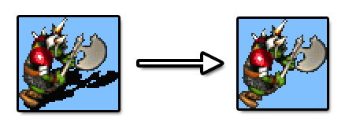

# Colour Remover

A simple program to remove areas of a given colour from images.

## Compile

From the `src` directory:

    javac main/*.java

## Run

From the `src` directory:

    java main.ColourRemover SOURCE_FOLDER COLOUR_TO_REMOVE THRESHOLD

Images are saved to an `out` directory.

### Parameters

#### SOURCE_FOLDER

Name of the directory containing the images to be processed.

#### COLOUR_TO_REMOVE

The colour to remove, in the form R,G,B.

#### THRESHOLD

Minimum number of connected pixels that must match the specified colour before an area will be removed. For example, if set to 3, areas of only 1 or 2 pixels of the specified colour will be preserved.

### Example

    java main.ColourRemover images 64,128,64 10
